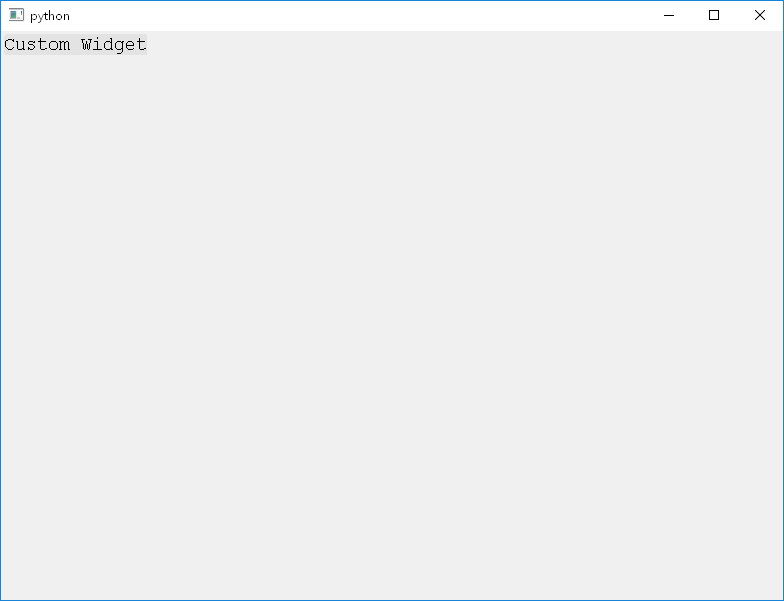
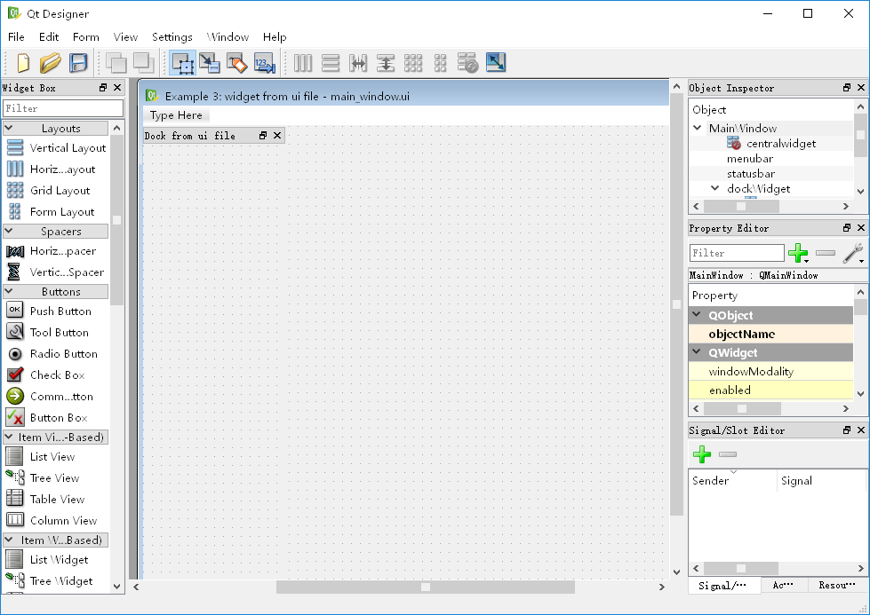

quite: QT UI Extension for Python3
==================================

|Build Status|

Features
--------

1. powerful signal-slot
2. user friendly widget classes

User Friendly Widget Classes
----------------------------

Uniform wrapper on frequently-used widget, including:

**container widget**:

1. `Widget <./quite/gui/widgets/widget.py>`__
2. `Dialog <./quite/gui/widgets/dialog.py>`__
3. `MainWindow <./quite/gui/widgets/main_window.py>`__
4. `GroupBox <./quite/gui/widgets/group_box.py>`__
5. `DockWidget <./quite/gui/widgets/dock_widget.py>`__

**value widget**:

1. `Label <./quite/gui/widgets/label.py>`__
2. `LineEdit <./quite/gui/widgets/line_edit.py>`__
3. `ComboBox <./quite/gui/widgets/combo_box.py>`__
4. `ListWidget <./quite/gui/widgets/list_widget.py>`__
5. `SpinBox <./quite/gui/widgets/spin_box.py>`__
6. `DoubleSpinBox <./quite/gui/widgets/double_spin_box.py>`__

**behavior widget**:

1. `InputDialog <./quite/gui/widgets/input_dialog.py>`__
2. `Action <./quite/gui/widgets/action.py>`__
3. `Shortcut <./quite/gui/widgets/shortcut.py>`__
4. `PushButton <./quite/gui/widgets/push_button.py>`__

Container Widget
~~~~~~~~~~~~~~~~

*Example 1*: `create widget <./examples/1_create_widget/example-1.py>`__

.. code:: python

    import quite

    w = quite.Widget()
    w.exec()

.. figure:: docs/images/1.simple.widget.png
   :alt: Simple Widget

   Simple Widget

*Example 2*: `nested widget <./examples/2_nested_widget/example-2.py>`__

.. code:: python

    import quite

    class CustomWidget(quite.Widget):
        def paint(self, painter: quite.Painter):
            painter.setFont(quite.QFont("Courier New", 14.0))
            painter.draw_text_bottom_right(quite.PointF(0, 0), "Custom Widget")
            painter.end()

    main_window = quite.MainWindow()
    custom_widget = CustomWidget(parent=main_window)
    main_window.set_central_widget(custom_widget)
    main_window.exec()

   Nested Widget

*Example 3*: `widget from ui
file <./examples/3_widget_from_ui_file/example-3.py>`__

.. code:: python

    import os
    from quite import *

    class CustomWidget(Widget):
        def paint(self, painter: Painter):
            w, _ = self.size
            painter.setFont(QFont("Courier New", 14.0))
            painter.draw_text_bottom_right(PointF(0, 0), "So Cool!")
            painter.draw_text_bottom_left(PointF(w, 0), "From Custom Widget")
            painter.end()

    main_window = load_ui(filename=os.path.join(os.path.dirname(__file__), 'main_window.ui'))
    main_window.set_central_widget(CustomWidget(parent=main_window))
    main_window.exec()

Use QtDesigner to create a ui file:

   UI Design

.. |Build Status| image:: https://travis-ci.com/KD-Group/quite.svg?branch=master
   :target: https://travis-ci.com/KD-Group/quite
