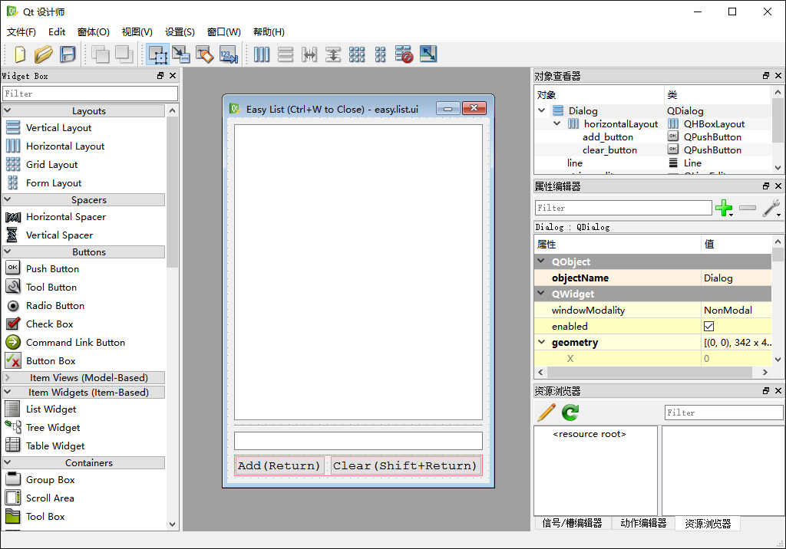
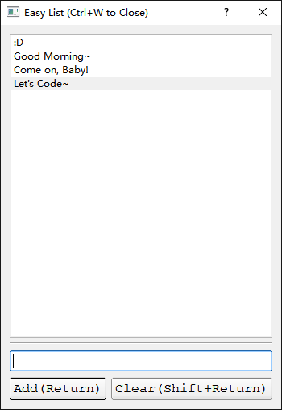

quite: QT UI Extension for Python3
==================================

A simple extension for PySide.

I hope it is useful for you, too. :D

====================
Powerful Signal-Slot
====================

.. code-block:: python

    import quite

    signal = quite.SignalSender()
    executed = [False]

    def slot(a: int, b: int, c: int):
        self.assertEqual(a, 1)
        self.assertEqual(b, 2)
        self.assertEqual(c, 3)
        executed[0] = True
    signal.connect(slot)

    signal.emit(1, 2, 3)
    self.assertTrue(executed[0])

============================
User Friendly Widget Classes
============================

.. code-block:: python

    import quite

    w = quite.Widget()
    w.exec()

And you will get that:

.. image:: docs/images/1.simple.widget.png
    :align: center
    :alt: Simple Widget

==============================================
Support Dynamic Loading Qt Designer's Ui Files
==============================================

You can just create a easy Ui by using Qt Designer, like this one:

And run the code like this:

.. code-block:: python

    import os
    import quite

    if __name__ == '__main__':
        current_path = os.path.dirname(__file__)
        ui_file_path = os.path.join(current_path, 'res', 'easy.list.ui')

        w = quite.load_ui(ui_file_path)
        assert isinstance(w.string_edit, quite.LineEdit)
        assert isinstance(w.string_list, quite.ListWidget)
        assert isinstance(w.add_button, quite.PushButton)
        assert isinstance(w.clear_button, quite.PushButton)

        quite.Shortcut('ctrl+w', w).excited.connect(w.close)

        @quite.connect_with(w.add_button.excited, w.string_edit, w.string_list)
        def add_string_to_list(string_edit: quite.LineEdit, string_list: quite.ListWidget):
            string_list.items.add(string_edit.string.value)
            string_list.index.value = string_list.items.count - 1
            string_edit.string.value = ''
            string_edit.set_focus()

        @quite.connect_with(w.clear_button.excited, w.string_edit, w.string_list)
        def clear_string_list(string_edit: quite.LineEdit, string_list: quite.ListWidget):
            string_list.items.clear()
            string_edit.string.value = ''
            string_edit.set_focus()

        @quite.connect_with(w.string_list.index.changed)
        def print_current_index_of_list(index):
            print('current index is', index)

        w.string_edit.set_focus()
        w.exec()

Well, you will get a easy but runnable application :D

