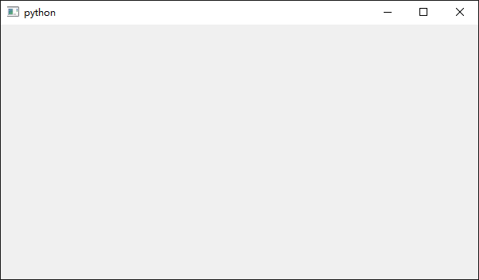

quite: QT UI Extension for Python3
==================================

.. image:: https://travis-ci.org/SF-Zhou/quite.svg?branch=master
    :target: https://travis-ci.org/SF-Zhou/quite
.. image:: https://app.wercker.com/status/36678b75b4b166a5a73b75de82bdbbd2/s/master
    :target: https://app.wercker.com/project/byKey/36678b75b4b166a5a73b75de82bdbbd2

A simple extension for PySide.

I hope it is useful for you, too. :D

====================
Powerful Signal-Slot
====================

.. code-block:: python

    import quite

    signal = quite.SignalSender()
    executed = [False]

    def slot(a: int, b: int, c: int):
        assert a == 1
        assert b == 2
        assert c == 3
        executed[0] = True

    signal.connect(slot)
    signal.emit(1, 2, 3)
    assert executed[0]

============================
User Friendly Widget Classes
============================

.. code-block:: python

    import quite

    w = quite.Widget()
    w.exec()

And you will get that:

